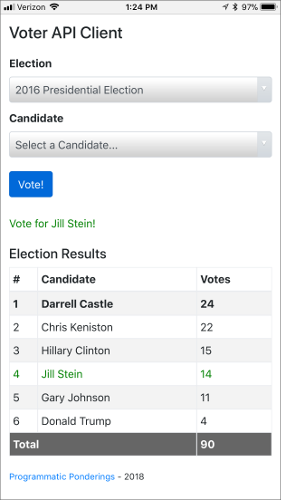

# Voter Client

Angular 5 application, used to demonstrate the [Voter API](https://github.com/garystafford/gke-istio-atlas-rabbit-demo).





## Angular CLI

This project was generated with [Angular CLI](https://github.com/angular/angular-cli) version 1.6.2.

## Development server

Run`ng serve` for a dev server. Navigate to`http://localhost:4200/`. The app will automatically reload if you change any of the source files.

## Code scaffolding

Run`ng generate component component-name` to generate a new component. You can also use`ng generate directive|pipe|service|class|guard|interface|enum|module`.

## Build

Run`ng build` to build the project. The build artifacts will be stored in the`dist/` directory. Use the`-prod` flag for a production build.

## Running unit tests

Run`ng test` to execute the unit tests via [Karma](https://karma-runner.github.io).

## Running end-to-end tests

Run `ng e2e` to execute the end-to-end tests via [Protractor](http://www.protractortest.org/).

## Further help

To get more help on the Angular CLI use`ng help` or go check out the [Angular CLI README](https://github.com/angular/angular-cli/blob/master/README.md).

 ## Project setup and run notes

 1. Download and install Yarn

```bash
npm install -g yarn
yarn
```
 
 2. Install the Angular CLI globally

```bash
yarn global add @angular/cli
```
 
 3. Update dependencies (_optional_)

```bash
 yarn global add david
 david update
 yarn add typescript@'>=2.4.2 <2.6' --save-dev
```
 
 4. Transpile and run continuously in development

```bash
 ng serve --open --dev
 ng serve --open --dev --env=prod
```
 
 5. Build for Production

```bash
 ng build --prod --env=prod
```

## Docker

The project includes a Dockerfile, based on the `nginx:1.13.8-alpine` base image. The Voter API Client Docker Image is available on Docker Hub. The latest image is `garystafford/voter-client:angular-0.6.70`.
